# 🚀 InternHub --- Smart Internship & Career Platform
> **Connect • Apply • Grow**

InternHub is an advanced, full-stack MERN-based web application designed to bridge the gap between ambitious students looking for professional exposure and recruiters seeking top talent. It provides a seamless, organized, and end-to-end digital environment where the entire internship journey—from profile creation to final hiring decisions—is managed smoothly.

---

## 📌 Table of Contents
1. [Project Overview](#-project-overview)
2. [Core Objectives](#-core-objectives)
3. [User Roles & Architecture](#-user-roles--architecture)
4. [Platform Features](#-platform-features)
5. [Complete User Workflow](#-complete-user-workflow)
6. [Visual Documentation (Screenshots Guide)](#-visual-documentation-screenshots-guide)
   - [studentScreenshots](#studentScreenshots)
   - [recruiterScreenshots](#recruiterScreenshots)
   - [adminScreenshots](#adminScreenshots)
7. [Technology Stack](#-technology-stack)
8. [Project Benefits](#-project-benefits)

---

## 1. 🔍 Project Overview
InternHub goes far beyond a standard job-listing portal. It represents a fully integrated career management ecosystem. 
* Students can build comprehensive professional profiles, highlight their projects, upload resumes, discover relevant internships, and track applications in real time.
* Recruiters are provided with dedicated corporate dashboards to publish positions, evaluate applicant portfolios, manage hiring statuses, and communicate directly.
* Administrators maintain complete platform integrity through user governance and strict recruiter verifications.

---

## 2. 🎯 Core Objectives
* To deliver a robust digital platform for students to showcase their professional identity.
* To simplify internship discovery, direct applications, and communication.
* To empower companies with intuitive tools for talent acquisition and management.
* To establish a transparent lifecycle tracker for application statuses and notifications.
* To ensure system safety and controlled access via administrative oversight.

---

## 3. 👥 User Roles & Architecture
The platform is segregated into three distinct user roles to maintain high security, data privacy, and a clean user experience:
* **👩‍🎓 Student:** Focused on learning, portfolio building, applying, and tracking.
* **🧑‍💼 Recruiter:** Focused on branding, publishing opportunities, filtering candidates, and hiring.
* **🛡️ Admin:** Focused on system monitoring, user control, and enterprise approvals.

---

## 4. ⚙️ Platform Features

### For Students
* **Secure Onboarding:** Easy registration and login with encrypted session management.
* **Professional Portfolios:** Custom profile creation including personal details, education history, technical skills, and live project links.
* **Resume Management:** Document uploading support to back up applications.
* **Smart Browsing & Details:** Detailed views of internships outlining work modes, required skill sets, stipends/types, and deadlines.
* **Direct Applications & Chat:** Submit customized cover letters and chat live with recruiters.

### For Recruiters
* **Corporate Branding:** Build unique company profiles with logos, company descriptions, and web links.
* **Opportunity Publishing:** Create and manage open internship listings effortlessly.
* **Candidate Evaluation Hub:** Review student profiles, inspect cover letters, and update application statuses (Pending, Shortlisted, Accepted, Rejected).
* **Instant Notifications:** Stay alerted the moment a student submits an application.

### For Administrators
* **Central Dashboard:** High-level platform monitoring and management.
* **Recruiter Approval System:** Verify and approve corporate accounts before they can post listings.
* **User Governance:** Total control over system users and platform activity.

---

---

## 6. 🖼️ Visual Documentation (Screenshots Guide)
Below is the complete architectural mapping of the visual assets organized cleanly across the platform's dedicated directories, featuring extensive descriptions spanning at least five lines each, along with centered previews for every individual screen.

---

### 🎓 Student Screenshots (`StudentScreenshots`)

  ## 🎓 Student Home
  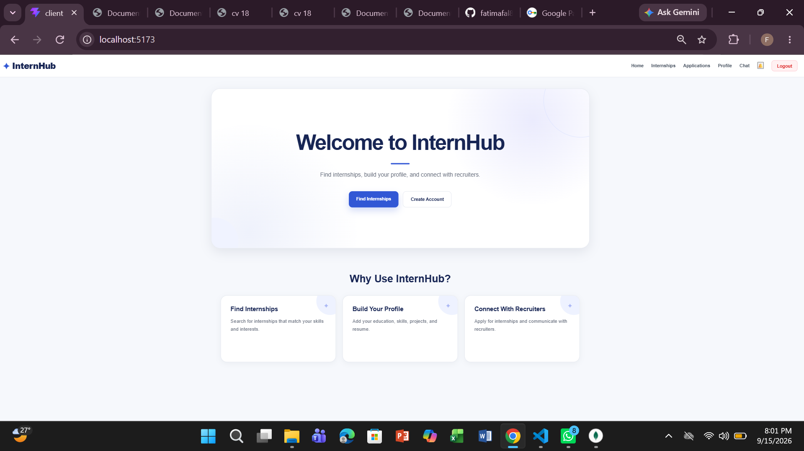

  The Student Home screen serves as the primary entry point and dynamic welcome gateway for the student side of the InternHub ecosystem. 
  It introduces incoming visitors to the platform's core vision of bridging academic talent with elite industry recruiters seamlessly. 
  This interface provides immediate, frictionless navigation links toward secure authentication pages and platform overview sections. 
  It highlights key platform capabilities like real-time tracking, secure chat, and personalized profile management dashboards. 
  Overall, it sets an engaging and professional tone to help new users easily transition into their active internship search journey.

---

  ## 🎓 Student Registration
  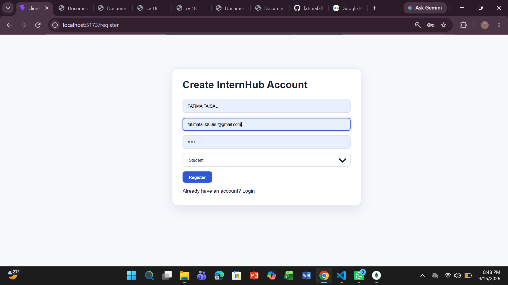

  The Student Registration screen allows new and aspiring candidates to create their official InternHub account from scratch. 
  By carefully filling out essential identification credentials, institutional details, and security parameters, users establish their profile foundations. 
  This interface incorporates strict form validations and error-handling mechanics to ensure data accuracy during user sign-up. 
  It officially opens the door to the student-specific ecosystem where they can manage job applications and portfolios. 
  Ultimately, it guarantees that every registered student possesses a verified and protected account identity within the database.

---

  ## 🎓 Student Login
  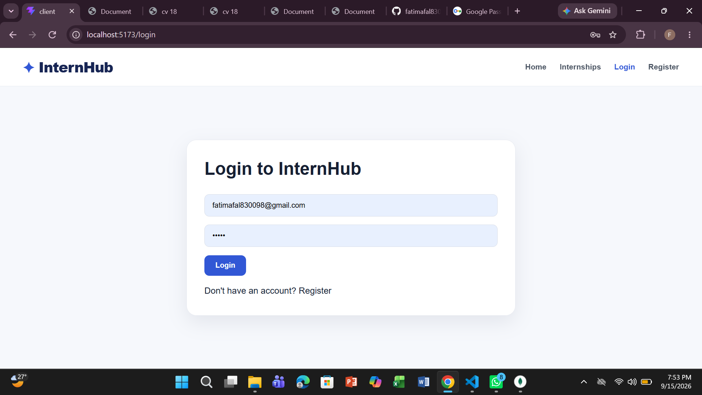

  The Student Login screen provides a highly secure, encrypted authentication gateway for returning students to safely access their personal accounts. 
  Powered by robust session handling, JSON Web Tokens (JWT), and token-based validation, it ensures total protection against unauthorized access. 
  It features clean input fields for email credentials and passwords along with direct prompts for account recovery options. 
  From here, authenticated users are safely redirected to their private portfolios and active internship catalogs. 
  It maintains continuous security integrity across all active user sessions throughout the platform lifecycle.

---

  ## 🎓 Student Profile
  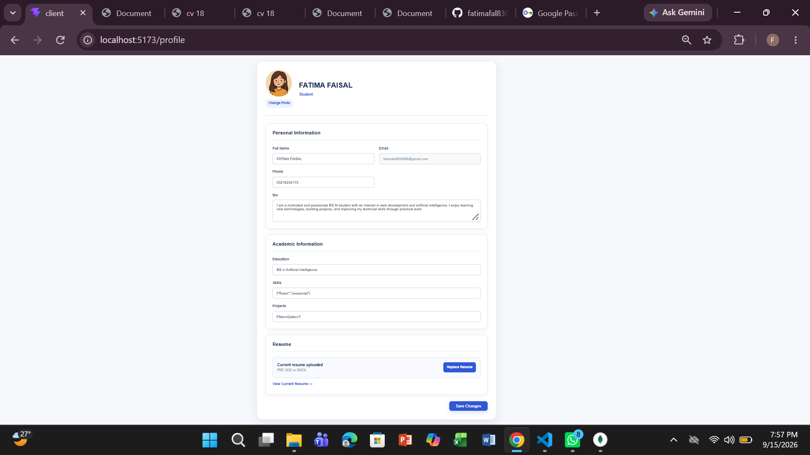

  The Student Profile screen functions as a comprehensive digital portfolio and resume-like hub where students highlight their professional identities. 
  It organizes critical details including personal bios, academic backgrounds, hard and soft technical skill sets, and creative project links. 
  Students can update their profile information dynamically to reflect their most recent academic achievements and acquired skills. 
  This layout acts as the primary evaluation dashboard that corporate recruiters inspect closely during candidate shortlisting phases. 
  It serves as the definitive showcase of a student's technical competence and readiness for professional internships.

---

  ## 🎓 Student Resume
  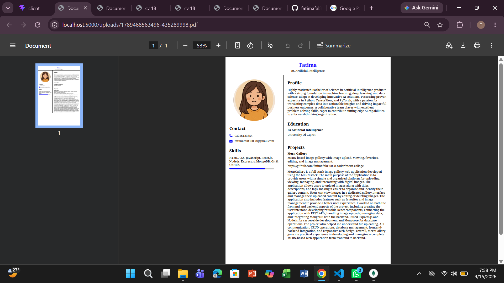

  The Student Resume screen represents the dedicated document repository and file management section of the student portal. 
  It handles uploaded curriculum vitae (CV) files and certification documents securely through Multer and cloud storage configurations. 
  This interface gives corporate recruiters deep, granular insights into educational history, past achievements, and specialized expertise. 
  Having a centralized resume viewer streamlines the evaluation process and eliminates the need for external file sharing. 
  It strongly backs up active job submissions and elevates overall hiring confidence for prospective employers.

---

  ## 🎓 Student Internship Listing
  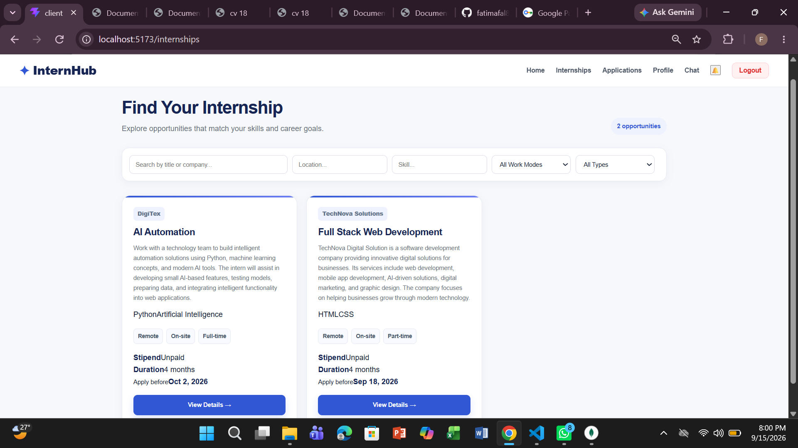

  The Student Internship Listing screen acts as the main discovery and exploration hub of the platform. 
  It features an organized, highly searchable catalog of all active and administrator-approved internship opportunities across diverse domains. 
  Students can dynamically browse, filter by categories or locations, and explore various roles matching their exact career aspirations. 
  The responsive grid layout ensures optimal viewing across different screen sizes and mobile or desktop devices. 
  It serves as the primary engine driving student engagement and career opportunity discovery within InternHub.

---

  ## 🎓 Student Internship Details
  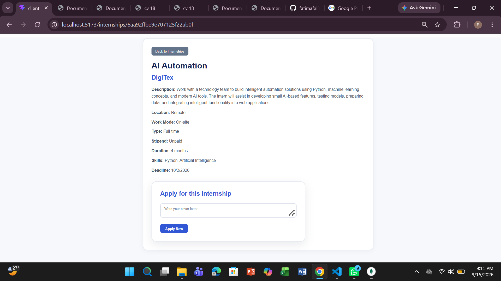

  The Student Internship Details screen provides an exhaustive, in-depth overview of a selected individual internship position. 
  Before submitting a formal application, students can review vital specifications such as granular job descriptions and corporate cultures. 
  It outlines important operational parameters including remote, hybrid, or onsite work modes and compensation or stipend types. 
  Users can carefully verify mandatory technical skill requirements, program duration, and final strict application expiration deadlines. 
  This transparency ensures that students apply only to positions that perfectly match their qualifications.

---

  ## 🎓 Student Application
  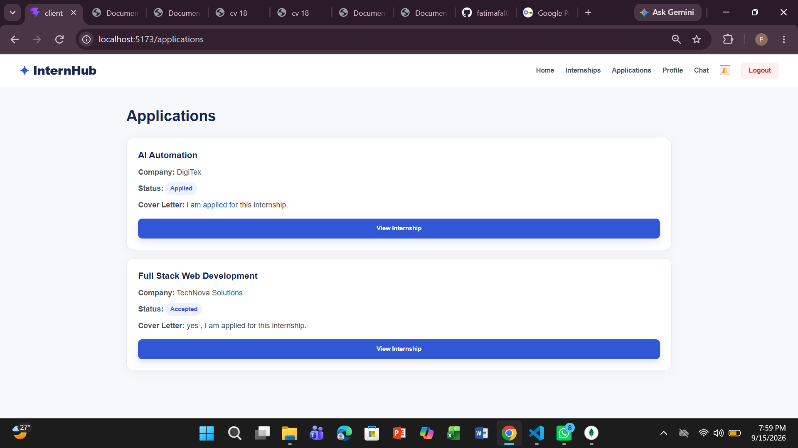

  The Student Application screen is the core submission portal where students formalize their interest in an open opportunity. 
  It allows users to write and attach customized cover letters alongside their core professional profiles seamlessly. 
  The interface packages everything neatly into a structured format for the hiring manager's review pipeline. 
  It validates submission parameters to prevent duplicate applications and ensures smooth data transfer to the backend database. 
  Ultimately, it plays a vital role in maximizing interview conversion rates and tracking active submission progress.

---

  ## 🎓 Student Chat
  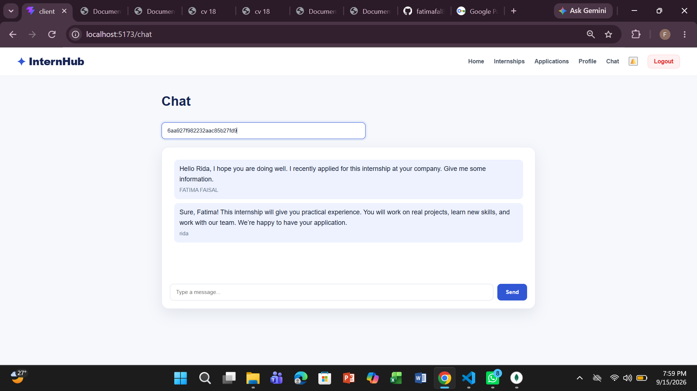

  The Student Chat screen provides a built-in, real-time messaging workspace powered by persistent socket communication (Socket.io). 
  It enables direct, professional communication channels between shortlisted applicants and corporate recruiters instantly. 
  Users can exchange text messages, discuss interview schedules, and negotiate internship expectations without switching platforms. 
  The chat interface includes unread message counters and live delivery indicators for enhanced user experience. 
  It bridges the communication gap between candidates and employers, fostering transparent and fast interactions.

---

### 🧑‍💼 Recruiter Screenshots (`recruiterScreenshots`)

  ## 🧑‍💼 Recruiter Registration
  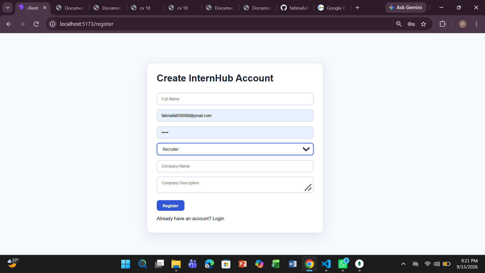

  The Recruiter Registration screen serves as the dedicated corporate onboarding portal where hiring organizations sign up. 
  It captures essential corporate credentials, company legal details, and professional identifiers securely. 
  This process initiates the strict administrative verification and approval workflow before publishing tools are unlocked. 
  It ensures that only legitimate companies and authorized hiring managers gain entry into the talent pool. 
  By maintaining strict onboarding checks, the platform protects student applicants from fraudulent or unverified entities.

---

  ## 🧑‍💼 Recruiter Profile
  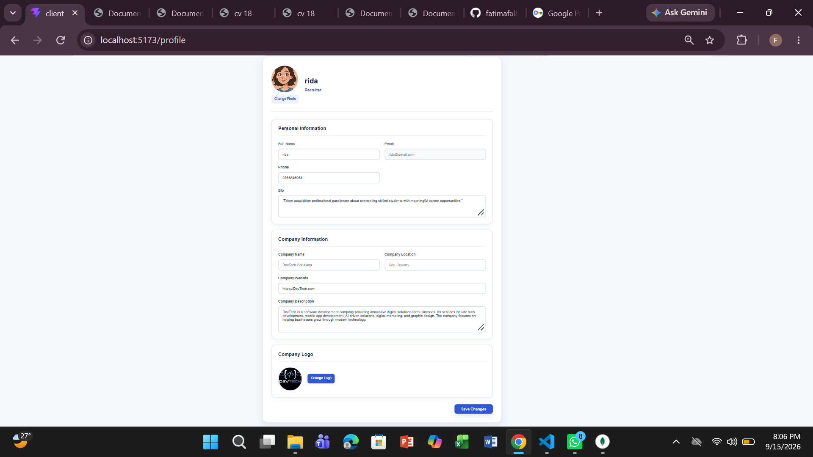

  The Recruiter Profile screen functions as the core corporate branding center for hiring companies on the platform. 
  It allows recruiters to build a robust organizational identity by uploading high-resolution company logos and branding elements. 
  Hiring managers can write detailed business descriptions, provide official website links, and specify physical office locations. 
  This transparency ensures student candidates gain full insights into potential employers before applying. 
  A well-optimized company profile significantly enhances corporate attractiveness and boosts application turnout rates.

---

  ## 🧑‍💼 Recruiter Dashboard
  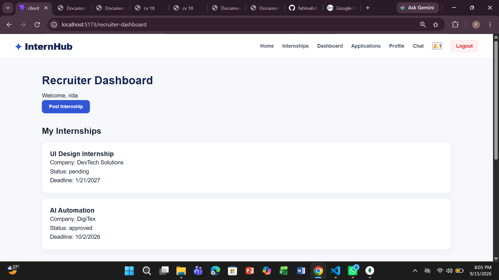

  The Recruiter Dashboard acts as the central command center for all talent acquisition and candidate management activities. 
  It provides hiring managers with a comprehensive bird's-eye view of active job postings and incoming application volumes. 
  Recruiters can monitor candidate pipeline performance metrics and access quick action shortcuts from a single unified interface. 
  The dashboard layout prioritizes key analytics to help managers make swift and informed hiring decisions. 
  It optimizes the overall recruitment workflow by reducing administrative overhead and streamlining daily tasks.

---

  ## 🧑‍💼 Recruiter Internship
  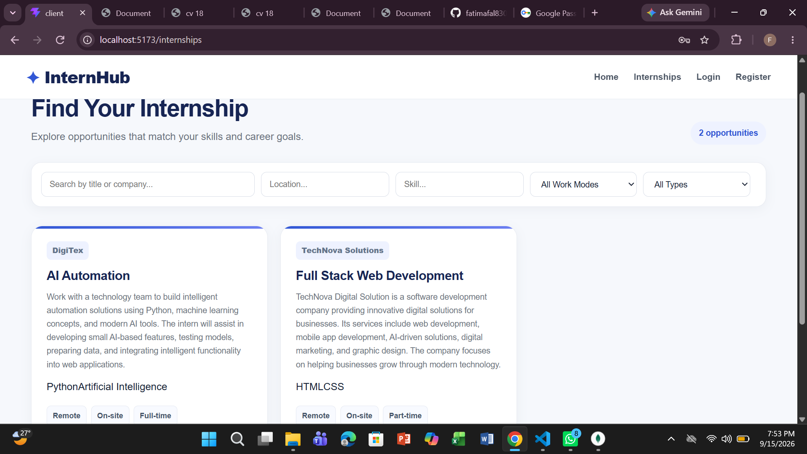

  The Recruiter Internship screen provides the structured creation and management form used to publish new career positions. 
  Recruiters can define precise details including job titles, exhaustive role descriptions, and required skill matrixes. 
  It allows managers to specify work arrangements, internship durations, and application expiration dates easily. 
  The publishing form validates all input fields to ensure complete and standardized job listings across the platform. 
  This targeted approach attracts the most qualified student candidates while minimizing unqualified applications.

---

  ## 🧑‍💼 Recruiter Applications
  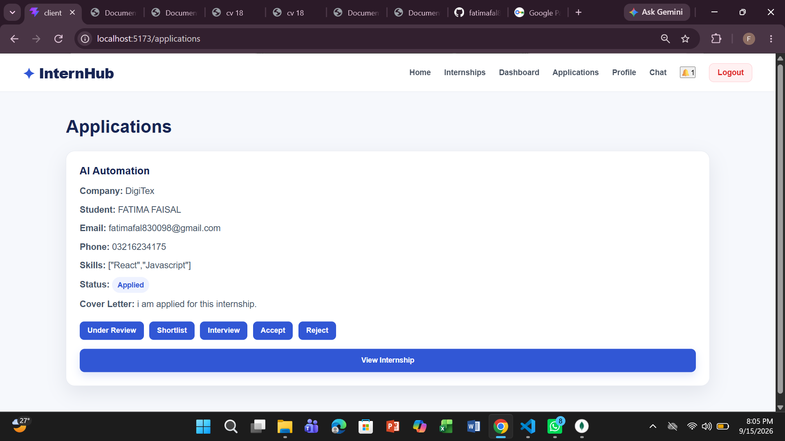

  The Recruiter Applications screen serves as the advanced applicant tracking system (ATS) and evaluation grid. 
  Here, recruiters can review candidate profiles, inspect attached cover letters, and evaluate technical qualifications. 
  It enables managers to dynamically update application stages such as Pending, Shortlisted, Accepted, or Rejected. 
  This systematic staging drives the hiring workflow forward efficiently and keeps applicant data organized. 
  It ensures clear accountability and communication throughout every stage of the recruitment lifecycle.

---

### 🛡️ Admin Screenshots (`adminScreenshots`)

  ## 🛡️ Admin Registration
  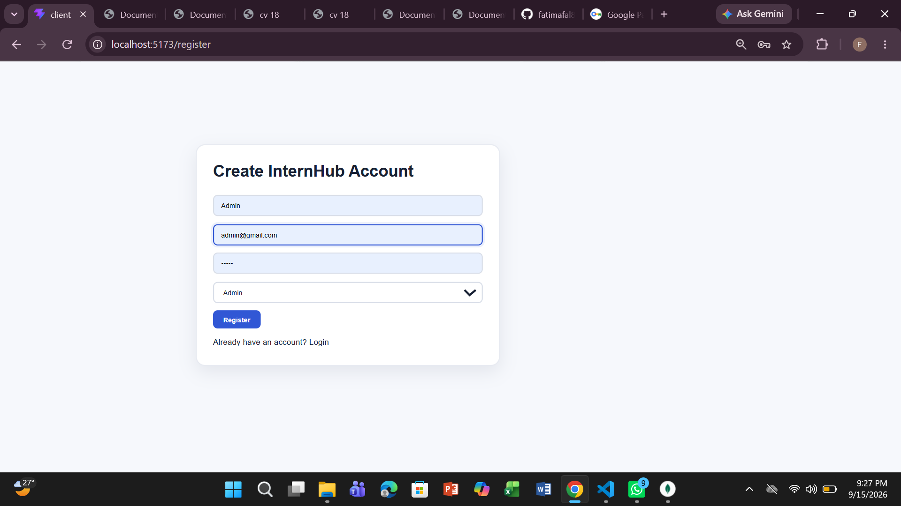

  The Admin Registration screen represents the secure, restricted account creation area designated exclusively for administrators. 
  It incorporates rigid security validation measures to ensure system-level management controls remain heavily protected. 
  Account creation requests at this level undergo intense backend verification to prevent unauthorized access. 
  It ensures that administrative rights are strictly segregated from standard student and recruiter user roles. 
  This security layer forms the bedrock of overall platform governance and data protection.

---

  ## 🛡️ Admin Profile
  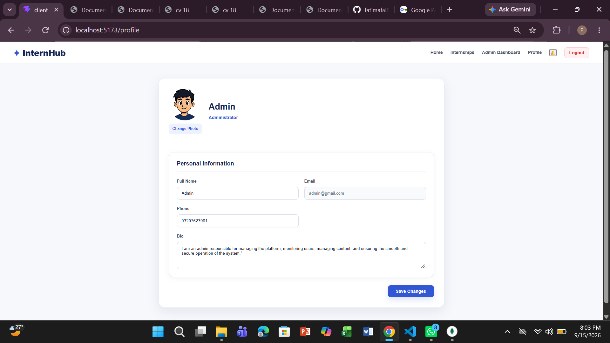

  The Admin Profile screen provides platform administrators with a specialized control panel to view and modify credentials. 
  It allows system controllers to update master authentication keys, contact details, and account configurations safely. 
  The interface maintains the absolute security integrity and personal profile parameters of system controllers. 
  Changes made here are logged to ensure complete auditing capability across administrative actions. 
  It guarantees that admin accounts remain accurate, up-to-date, and fully secured at all times.

---

  ## 🛡️ Admin Dashboard
  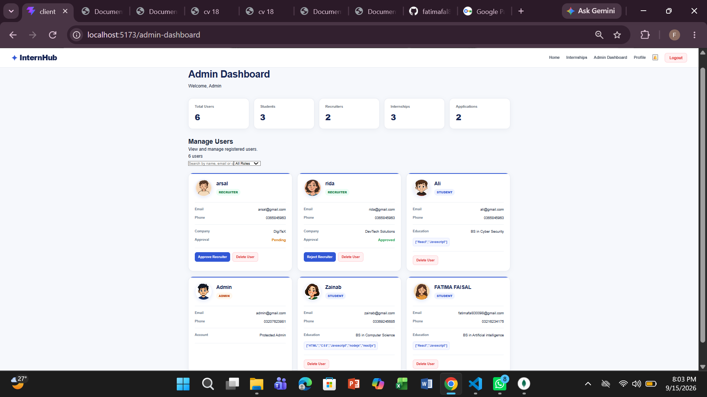

  The Admin Dashboard is the high-level macro management hub of the entire platform architecture. 
  It grants administrators complete system-wide visibility, offering powerful analytics tools to monitor global activities. 
  Controllers can oversee user directories, inspect system error logs, and manage enterprise verification approvals. 
  The dashboard aggregates critical platform metrics into a clean, centralized control interface. 
  It empowers administrators to maintain absolute system health, security, and operational balance.

---

  ## 🛡️ Notifications
  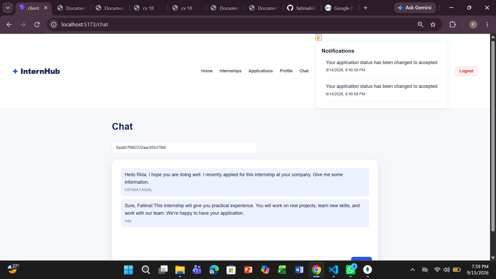

  The Notifications screen represents the integrated system-wide alert and messaging hub for platform users. 
  It keeps users across all tiers instantly informed about critical lifecycle events without requiring manual refreshes. 
  Events tracked include new student job applications, corporate account approvals, and application status modifications. 
  The real-time notification mechanism ensures total transparency and responsiveness across the entire ecosystem. 
  It bridges communication gaps and ensures no important platform activity goes unnoticed by stakeholders.

---

  
